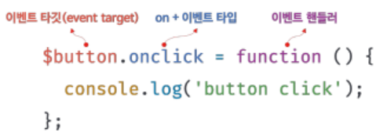
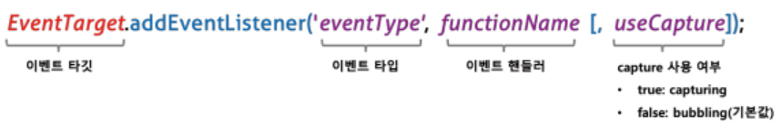
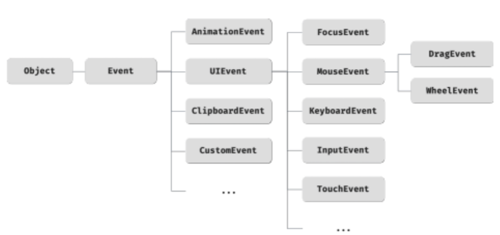

# 40 이벤트

## 40.1 이벤트 드리븐 프로그래밍

특정 타입의 이벤트에 반응하여 일을 하기 위해서는 호출될 함수를 브라우저에게 할려 호출을 위임한다.

#### 이벤트 드리븐 프로그래밍

> 프로그램의 흐름을 이벤트 중심으로 제어하는 프로그래밍 방식을 이벤트 드리븐 프로그래밍이라 한다. 이 방식은 이벤트와 그에 대응하는 함수를 통해 사용자와 애플리케이션이 상호작용한다.

## 40.2 이벤트 타입(=이벤트의 종류)

약 200여가지가 존재한다.

### 40.2.1 마우스 이벤트

- click : 마우스 버튼 클릭 시
- dblclick : 마우스 버튼 더블 클릭 시
- mousedown : 마우스 버튼 눌렀을 때
- mouseup : 마우스 버튼 놓았을 때
- mousemove : 마우스 커서 움직였을 때
- mouseenter : 마우스 커서를 HTML 요소 안으로 이동했을 때 (버블링 X)
- mouseleave : 마우스 커서를 HTML 요소 밖으로 이동했을 때 (버블링 X)
- mouseover : 마우스 커서를 HTML 요소 안으로 이동했을 때 (버블링 O)
- mouseout : 마우스 커서를 HTML 요소 밖으로 이동했을 때 (버블링 O)

### 40.2.2 키보드 이벤트

- keydown : 모든 키를 눌렀을 때 발생. (문자, 숫자, 특수문자, enter 키를 눌렀을 때는 연속적으로 발생하지만 그 외는 한 번만 발생)
- keypress : 문자 키를 눌렀을 때 연속적으로 발생 (폐지되었으므로 사용하지 않는 것을 권장)
- keyup : 누르고 있던 키를 놓았을 때 한번만 발생

### 40.2.3 포커스 이벤트

- focus : HTML 요소가 포커스를 받았을 때 (버블링 X)
- blur : HTML 요소가 포커스를 잃었을 때 (버블링 X)
- focusin : HTML 요소가 포커스를 받았을 때 (버블링 O)
- focusout : HTML 요소가 포커스를 잃었을 때 (버블링 O)

※ focusin, focusout 이벤트 핸들러는 addEventListener 메서드 방식을 사용해야
한다.

### 40.2.4 폼 이벤트

#### submit

- form 요소 내의 input(text, checkbox, radio), select 입력 필드에서 엔터 키를 눌렀을 때
- form 요소 내의 submit 버튼(button 태그, type='submit'인 input 버튼) 클릭 시

#### reset

- form 요소 내의 reset 버튼 클릭시 (최근에는 사용하지 않음)

### 40.2.5 값 변경 이벤트

- input : input, select, textarea 요소의 값이 입력됐을 때
- change : input, select, textarea 요소의 값이 변경됐을 때  
  ※ 사용자가 입력을 하고 있을 때는 input 이벤트가 발생하고, 사용자 입력이 종료되었다고 인식하여 값이 변경되면 change 이벤트가 발생한다.
- readystatechange : HTML 문서의 로드와 파싱 상태를 나타내는 document.readyState 프로퍼티 값('loading', 'interactive', 'complete')이 변경될 때

### 40.2.6 DOM 뮤테이션 이벤트

#### DOMContentLoaded

HTML 문서의 로드와 파싱이 완료되어 **DOM 생성이 완료되었을 때**

### 40.2.7 뷰 이벤트

- resize : 브라우저 윈도우의 크기를 리사이즈 할 때 연속적으로 발생
- scroll : 웹페이지(document) or HTML요소를 스크롤할 때 연속적으로 발생

### 40.2.8 리소스 이벤트

- load : DOMContentLoaded 이벤트가 발생한 이후, 모든 리소스의 로딩이 완료됐을 때
- unload : 리소스가 언로드될 때(e.g | 주로 새로운 웹페이지를 요청한 경우)
- abort : 리소스 로딩이 중단됐을 때
- error : 리소스 로딩이 실패했을 때

## 40.3 이벤트 핸들러 등록

> **이벤트 핸들러**란 이벤트가 발생했을 때 호출될 함수이다.

> 이벤트 이벤트가 발생했을 때, 브라우저에게 이벤트 핸들러의 호출을 위임하는 것을 **이벤트 핸들러 등록**이라 한다.

### 40.3.1 이벤트 핸들러 어트리뷰트 방식

- HTML요소의 어트리뷰트 중에는 이벤트에 대응하는 이벤트 핸들러 어트리뷰트가 있다.

- on 접두사 + 이벤트의 타입 (예: onclick)

```
<button onclick="sayHi('Jang')">
```

- 이벤트 핸들러 어트리뷰트 값으로 함수 참조가 아닌 호출문 등의 문(statement)을 할당하면 이벤트 핸들러가 등록된다.

- 이벤트 핸들러 등록 시, 함수 참조를 등록해야 브라우저가 이벤트 핸들러를 호출할 수 있다. 하지만 이벤트 핸들러 어트리뷰트 값은 사실 암묵적으로 생성될 이벤트 핸들러의 함수 몸체를 의미한다.

```
// 암묵적으로 아래와 같은 함수를 생성하여 이벤트 핸들러 프로퍼티에 할당한다.
function onclick(event) {
    sayHi('Jang');
}
```

- 이벤트 핸들러 어트리뷰트 방식은 인수 전달에 용이하다.

- HTML과 자바스크립트의 관심사 분리를 위해 사용하지 않는 것이 좋으나, CBD 방식의 Angular/React/Svelte/Vue.js 와 같은 프레임워크에서는 이벤트 핸들러 어트리뷰터 방식으로 이벤트를 처리한다.

### 40.3.2 이벤트 핸들러 프로퍼티 방식

- window 객체와 DOM 노드 객체(Dcoument, HTMLElement 타입)는 이벤트에 대응하는 이벤트 핸들러 프로퍼티를 가지고 있다.

- on 접두사 + 이벤트 타입

- 이벤트 핸들러 프로퍼티에 함수를 바인딩하면 이벤트 핸들러가 등록된다.

- 이벤트 타깃, 이벤트 타입, 이벤트 핸들러가 필요하다.



- 이벤트 핸들러는 대부분 이벤트 타깃 or 전파된 이벤트를 캐치할 DOM 노드 객체에 바인딩한다.

- 이벤트 핸들러 어트리뷰터 방식도 DOM 노드 객체의 이벤트 핸들러 프로퍼티로 변환되므로 이벤트 프로퍼티 방식과 동일하다고 볼 수 있다.

- 장점: HTML과 자바스크립트가 뒤섞이는 문제를 해결할 수 있다.
- 단점: 이벤트 핸들러 프로퍼티에 하나의 이벤트 핸들러만 바인딩할 수 있다

### 40.3.3 addEventListener 메서드 방식



- addEventListener 메서드는 하나 이상의 메서드를 등록힐 수 있으며, 등록된 순서대로 호출된다.

- 동일한 이벤트 핸들러를 중복 등록하면 하나의 핸들러만 등록된다.

## 40.4 이벤트 핸들러 제거

- EventTarget.prototype.**removeEventListener 메서드**의 인수로 addEventListener 메서드로 이벤트를 등록할 때와 동일한 인수를 전달하면 이벤트 핸들러가 제거된다.

- 이벤트 핸들러를 제거하려면 이벤트 핸들러의 참조를 변수나 자료구조에 저장해야 한다. 때문에 무명 함수로 등록한 이벤트 핸들러는 제거할 수 없다.

- arguments.calle를 사용하여 함수 자기 자신을 가리켜 제거할 수 있지만 strict mode에서는 금지되므로 사용하지 않는 것이 좋다.

- **이벤트 핸들러 프로퍼티 방식**으로 등록한 이벤트는 이벤트 핸들러 프로퍼티에 **null을 할당하여 제거** 가능하다.

## 40.5 이벤트 객체

- 이벤트가 발생하면 이벤트에 관한 다양한 정보를 담고 있는 이벤트 객체가 동적으로 생성되고, 이벤트 핸들러의 첫 번째 인수로 전달된다.

- 이벤트 핸들러 어트리뷰터 방식으로 등록한 경우 반드시 event라는 이름을 통해 이벤트 객체를 전달받는다.

### 40.5.1-2 이벤트 객체의 상속 구조와 공통 프로퍼티



- Event, UIEvent, MouseEvent 등 모두는 생성자 함수이므로, 생성자 함수를 호출하여 이벤트 객체를 생성할 수 있다.

```
let e = new Event('foo');
console.log(e); // Event {isTrusted: false ...}
```

- 이벤트 발생시 암묵적으로 생성되는 **이벤트 객체도 생성자 함수에 의해 생성**되고, 생성자 함수와 더불어 생성되는 프로토타입으로 구성된 프로토타입 체인의 일원이 된다.

- 이벤트 객체 중 일부는 사용자의 행위에 의해 일부는 자바스크립트 코드에 의해 인위적으로 생성된다.

- Event 인터페이스는 DOM 내에서 발생한 이벤트에 의해 생성되는 이벤트 객체로, 모든 이벤트 객체의 공통 프로퍼티가 정의되어 있다.

- Event 인터페이스(Event.prototype)에 정의된 이벤트 관련 프로퍼티는 모든 파생 이벤트 객체(UIEvent, CustomEvent, MouseEvent 등)에 상속된다.

- 하위 인터페이스에는 이벤트 타입에 따른 고유한 프로퍼티가 정의되어 있다.

#### 이벤트 객체의 공통 프로퍼티

| 공통 프로퍼티    | 설명                                                                                                                                        | 타입          |
| ---------------- | ------------------------------------------------------------------------------------------------------------------------------------------- | ------------- |
| type             | 이벤트 타입                                                                                                                                 | string        |
| target           | 이벤트를 발생시킨 DOM요소                                                                                                                   | DOM요소 노드  |
| currentTarget    | 이벤트 핸들러가 바인딩된 DOM 요소                                                                                                           | DOM 요소 노드 |
| eventPhase       | 이벤트 전파 단계 (0:이벤트 없음, 1:캡처링, 2:타깃, 3:버블링)                                                                                | number        |
| bubbles          | 버블링으로 전파하는지 여부                                                                                                                  | boolean       |
| cancelable       | preventDefault 메서드 호출로 기본 동작을 취소할 수 있는지 여부 (false : focus/blur, load/unload/abort/error, dbclick/mouseenter/mouseleave) | boolean       |
| defaultPrevented | preventDefault 메서드를 호출하여 취소했는지 여부                                                                                            | boolean       |
| isTrusted        | 사용자 행위에 의해 발생한 이벤트인지 여부. 인위적으로 발생시킨 경우 false                                                                   | boolean       |
| timeStamp        | 이벤트가 발생한 시각                                                                                                                        | number        |

### 40.5.3 마우스 정보 취득

#### MouseEvent 타입의 이벤트 객체가 갖는 고유 프로퍼티

- 마우스 포인터의 좌표 정보를 나타내는 프로퍼티
  - screenX/screenY
  - clientX/clientY : 웹 페이지의 가시 영역을 기준으로 현재마우스 포인터 좌표
  - pageX/pageY
  - offsetX/offsetY
- 버튼 정보를 나타내는 프로퍼티 : altKey, ctrlKey, shiftKey, button

### 40.5.4 키보드 정보 취득

- keyBoardEvent 타입의 이벤트 객체가 갖는 고유 프로퍼티 : ctrlKey, shiftKey, metaKey, key, keyCode

## 40.6 이벤트 전파

> DOM 요소 노드에서 발생한 이벤트는 DOM 트리를 통해 전파되는데, 이를 이벤트 전파라고 한다.

#### 캡처링 단계

이벤트가 상위 요소에서 하위 요소 방향으로 전파

#### 타깃 단계

이벤트가 이벤트 타깃에 도달

#### 버블링 단계

이벤트가 하위 요소에서 상위 요소 방향으로 전파

- 이벤트 핸들러 어트리뷰트/프로퍼티 방식으로 등록한 이벤트 핸들러는 타깃 단계와 버블링 단계의 이벤트만 캐치할 수 있다.
- addEventListener 메서드 방식으로 등록한 이벤트 핸들러는 타깃, 버블링, 캡처링 단계의 이벤트(세번째 인수로 true를 전달)도 선별적으로 캐치할 수 있다.

- 이벤트는 이벤트를 발생시킨 이벤트 타깃뿐만 아니라 DOM 트리상의 경로에 위치한 모든 DOM요소에서 캐치할 수 있다.

- focus/blur, load/unload/abort/error, mouseenter/mouseleave 이벤트는 버블링을 통해 전파되지 않는다.

## 40.7 이벤트 위임

> 이벤트 위임은 여러개의 하위 DOM 요소에 각각 이벤트 핸들러를 등록하는 대신 하나의 상위 DOM 요소에 이벤트 핸들러를 등록하는 방법이다.

※ 주의점

- 상위 요소에 이벤트 핸들러를 등록하기 때문에 이벤트를 실제로 발생시킨 DOM 요소가 개발자가 기대한 DOM 요소가 아닐 수 있다.
- target과 currentTarget 프로퍼티가 다른 DOM 요소를 가리킬 수 있다.

### Element.prototype.matches 메서드

> 인수로 전달된 선택자에 의해 특정 노드를 탐색 가능한한지 확인한다.

## 40.8 DOM 요소의 기본 동작 조작

### 40.8.1 DOM 요소의 기본 동작 중단

preventDefault 메서드 사용

### 40.8.2 이벤트 전파 방지

#### stopPropagation 메서드

- 자신이 발생시킨 이벤트가 전파되는 것을 중단하여 자신에게 바인딩된 이벤트 핸들러만 실행한다.
- 하위 DOM 요소의 이벤트를 개별적으로 처리하기 위해 사용한다.

## 40.9 이벤트 핸들러 내부의 this

### 40.9.1 이벤트 핸들러 어트리뷰트 방식

- 어트리뷰트의 값은 암묵적으로 생성되는 이벤트 핸들러의 문으로 이벤트 핸들러에 의해 일반 함수로 호출된다.
- 일반 함수로 호출되는 함수 내부의 this는 전역 객체(=window)를 가리킨다.

- 단, 이벤트 핸들러를 호출할 때 인수로 전달한 this 는 이벤트를 바인딩한 DOM 요소를 가리킨다.

```
<!DOCTYPE html>
<html>
  <body>
    <button onclick="handleClick(this)">click</button>
    <script>
      function handleClick(btn) {
        console.log(this); //window
        console.log(btn); //이벤트를 바인딩한 button 요소
      }
    </script>
  </body>
</html>
```

### 40.9.2 이벤트 핸들러 프로퍼티 방식/ addEventListener 방식

- 두 방식 모두 이벤트 핸들러 내부의 this는 이벤트를 바인딩한 DOM 요소를 가리킨다.  
  즉, **이벤트 핸들러 내부의 this는 이벤트 객체의 currentTarget 프로퍼티와 같다.**

- 화살표 함수는 함수 자체의 바인딩을 갖지 않기 때문에, 화살표 함수로 정의한 이벤트 핸들러 내부의 this는 상위 스코프의 this를 가리킨다.

- 클래스에서 이벤트 핸들러를 바인딩하는 경우
  - 화살표 함수를 이벤트 핸들러로 등록해 this 가 인스턴스를 가리키도록 한다.
  - bind 메서드를 사용해 this를 전달하여 increase 메서드 내부의 this가 클래스가 생성한 인스턴스를 가리키도록 한다.

```
<!DOCTYPE html>
<html>
  <body>
    <button class="btn">click</button>
    <script>
      class App {
        constructor() {
          this.$button = document.querySelector(".btn");
          this.count = 0;

          this.$button.onclick = this.increase.bind(this);
        }

        increase() {
          this.$button.textContent = ++this.count;
        }
      }

      new App();
    </script>
  </body>
</html>
```

## 40.10 이벤트 핸들러에 인수 전달

- 이벤트 핸들러 어트리뷰트 방식은 호출문을 사용하여 인수를 전달할 수 있다.
- 이벤트 핸들러 프로퍼티 방식/addEventListener 메서드의 경우 브라우저가 이벤트 핸들러를 호출하기 때문에 함수 호출문이 아닌 함수 자체를 등록해야 한다.
- 때문에 이벤트 핸들러 프로퍼티 방식/addEventListener 메서드 인수 전달을 위해서는
  - 이벤트 핸들러 내부에서 함수를 호출하면서 인수를 전달한다.
  - 이벤트 핸들러를 반환하는 함수를 호출하면서 인수를 전달한다.

## 40.11 커스텀 이벤트

### 40.11.1 커스텀 이벤트 생성

> 이벤트 생성자 함수를 호출하여 명시적으로 생성한 이벤트 객체에 임의의 이벤트를 지정할 수 있다.  
> 이처럼 개발자 의도로 생성된 이벤트를 커스텀 이벤트라 한다.

- 이벤트 생성자 함수의 첫번째 인수는 이벤트 타입(문자열)을 전달한다.

- CustomEvent 이벤트 생성자 함수를 사용한다.

- 커스텀 이벤트 객체는 bubbles/cancelable 프로퍼티의 기본값이 false이며, true 로 설정하기 위해서는 두번째 인수로 프로퍼티 설정을 전달한다.

- 이벤트 타입에 따른 고유의 프로퍼티 값을 지정할 수 있다.
  - 이벤트 생성자 함수의 두번째 인수로 프로퍼티를 전달

```
const mouseEvent = new MouseEvent('click', {
  bubbles: true,
  cancelable: true,
  clientX: 50,
  clientY: 100
});
```

- 사용자의 행위에 의해 발생한 이벤트의 이벤트 객체는 isTrusted 프로퍼티 값이 언제나 true이나, 생성자 함수로 생성한 커스텀 이벤트는 isTrusted 프로퍼티 값이 언제나 false이다.

### 40.11.2 커스텀 이벤트 디스패치

- 생성된 커스텀 이벤트는 dispatchEvent 메서드의 인수로 이벤트 객체를 전달하여 **디스패치(이벤트를 발생시키는 행위)**할 수 있다.

- 일반적으로 이벤트 핸들러는 비동기 처리 방식으로 동작하지만 dispatchEvent 메서드는 이벤트 핸들러러를 **동기 처리 방식**으로 호출한다.

- dispatchEvent 메서드를 호출하면 커스텀 이벤트에 바인딩된 이벤트 핸들러를 직접 호출하는 것과 같다.

- Custom 이벤트 생성자 함수는 두번째 인수로 함께 전달하고 싶은 정보를 담은 **detail 프로퍼티**를 포함하는 객체를 전달할 수 있다.

```
const customEvent = new CustomEvent('foo', e => {
  detail: { message: 'Hello' }
});
```

- 커스텀 이벤트 객체는 'on+이벤트 타입'으로 이루어진 이벤트 핸들러 어트리뷰터/프로퍼티가 없기 때문에, **반드시 addEventListener 방식**으로 이벤트 핸들러를 등록해야 한다.
