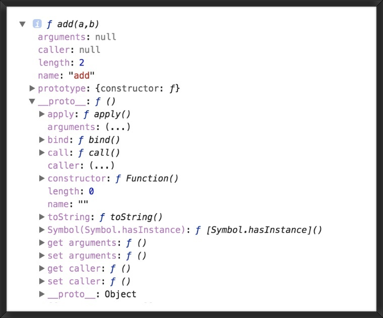

## p 132

window.name

- 창의 이름을 얻거나/설정합니다.

```
string = window.name;
window.name = string;
```

### 예시

```
window.name = "lab_view";
```

## 원시 타입 vs 객체 타입

- 원시 타입의 값, 즉 원시 값은 변경 불가능한 값이다. 이에 비해 객체 타입의 값, 즉 객체는 변경 가능한 값이다.
- 원시 값을 변수에 할당하면 변수에는 실제 값이 저장된다. 이에 비해 객체를 변수에 할당하면 변수에는 참조 값이 저장된다.
- 원시 값을 갖는 변수를 다른 변수에 할당하면 원본의 원시 값이 복사되어 전달된다. 이를 값에 의한 전달이라 한다. 이에 비해 객체를 가리키는 변수를 다른 변수에 할당하면 원본의 참조 값이 복사되어 전달된다. 이를 참조에 의한 전달 이라 한다.

## 유사 배열 객체 (p.141)

```
const range = (start, end) => {
    const length = end - start + 1;

    return Array.from({ length }).map((_, index) => index + start);

  };
```

- 문자열도 유사 배열 객체였다..!
- 벨로그 참고

## V8 히든 클래스 (p.147)

- 내가 이해한 내용은 모든 객체는 참조해야 하는 히든 클래스를 가지고 있고 상태가 변경될때마다 참조 값과 비교한다.

### 객체가 변경가능한 이유

- 원시 값처럼 이전 값을 복사해서 새로 생성한다면 명확하고 신뢰성이 확보되겠지만 객체는 크기가 매우 클수도 있고, 일정하지 않기 때문에 효율적인 소비가 어렵고 성능이 나쁘다. 그래서 변경 가능한 값으로 설계한것!

## 함수는 객체다.!

- 일반 객체는 호출 불가능하지만 함수는 호출 가능한 객체.

### 함수의 특징

- 변수나 데이터 구조안에 담을 수 있다.
- 파라미터로 전달 할 수 있다.
- 반환값(return value)으로 사용할 수 있다.
- 동적으로 프로퍼티 할당이 가능하다.

### 왜 일급 객체인지??

- 모든 일급 객체는 변수나 데이터에 담을 수 있어야 한다.
- 모든 일급 객체는 함수의 파라미터로 전달 할 수 있어야 한다.
- 모든 일급 객체는 함수의 리턴값으로 사용 할수 있어야 한다.

#### 프로퍼티들

- arguments : 함수를 호출할 때 전달된 인자 값을 갖고 있는 유사배열객체
- caller : 이 함수를 호출한 함수.
- length : 함수에 정의된 파라미터의 개수.
- name : 함수의 이름.
  

## 함수 호이스팅

- 변수 호이스팅과는 다르다. 변수는 undefined를 보여주지만 함수 선언문은 호출이 가능하다.

## p 165 (함수 표현식의 호이스팅??)

### ??

> 함수 표현식은 변수에 할당되는 값이 함수 리터럴인 문이다. 따라서 함수 표현식은 변수 선언문과 변수 할당문을 한 번에 기술한 축약 표현과 동일하게 동작한다. 변수 선언은 런타임 이전에 실행되어 undefined로 초기화되지만 변수 할당문의 값은 할당문이 실행되는 시점, 즉 런타임에 평가되므로 함수 표현식의 함수 리터털도 할당문이 실행되는 시점에 평가되어 함수 객체가 된다. 따라서, 함수 표현식으로 함수를 정의하면 함수 호이스팅이 발생하는 것이 아니라 변수 호이스팅이 발생한다.

- 무슨말이냐면 var a; var a = 10; 과 같이 변수 선언과 할당문이 있다.
- 변수 호이스팅에 의하면 런타임전에 undefined를 할당하고 런타임에 10을 준다
- 함수 표현식도 마찬가지로

```
var a = a (x,y){
  console.log(xy)
}
```

- a 에 undefined를 할당하고 런타임에 함수 객체를 할당하기 때문.

## 함수는 한 가지 일만 해야 하며 가급적 작게 만들어야 한다.

- 함수의 매개변수의 개수는 제한이 없다.

## 즉시실행함수

- ()로 감싸야한다. (그룹연산자.)

## 재귀 함수

- 자기 자신을 호출하는 함수.

```
function countdown(n){
  if(n<0) return;
  console.log(n);
  countdown(n-1);
}
countdown(10)
```

```
function factorial (n){
  if(n<=1) reutrn 1;
  return n * factorial(n -1)
}
```

- 재귀함수 익숙하지 않아서 예제를 적어봄.
- 무한히 호출하기 때문에 반드시 탈출문을 적어야함.

### 고차함수, 콜백함수 .

```
function repeat(n, f) {
  for (let i = 0; i < n; i++) {
    f(i);
  }
}

let logAll = function (i) {
  console.log(i);
};

repeat(5, logAll);

let logOdds = function (i) {
  if (i % 2) console.log(i);
};

repeat(5, logOdds);

```

## 순수함수

- 인수의 불변성

## 비순수 함수

- 외부 상태에 따라 값이 변하는 함수

# 함수형 프로그래밍 패러다임

> 순수 함수와 보조 함수의 조합을 통해 외부 상태를 변경하는 부수 효과를 최소화해서 불변성을 지향하는 프로그래밍 패러다임이다. 로직 내에 존재하는 조건문과 반복문을 제거해서 복잡성을 해결하고, 변수 사용을 억제하거나 생명주기를 최소화해서 상태 변경을 피해 오류를 최소화하는 것을 목표로 한다.

## 스코프

- var, let과 const의 스코프는 다르게 동작한다.
- 함수 파라미터의 스코프는 함수 내부에서만.

### 문제

```
var x = 1;

function foo() {
  var x = 10;
  bar(); // 호출 시점
}

function bar() {
  console.log(x);
} // 선언  시점

foo(); // ?
bar(); // ?
```

- 답은?
- 렉시컬 스코프는 함수를 어디서 호출하는지가 아니라 어디에 선언하였는지에 따라 결정된다.
- 함수를 어디에서 호출하였는지는 스코프 결정에 아무런 의미를 주지 않는다. 위 예제의 함수 bar는 전역에 선언되었다. 따라서 함수 bar의 상위 스코프는 전역 스코프이고 위 예제는 전역 변수 x의 값 1을 두번 출력한다.

## 지역 스코프

- 지역 변수는 자신의 지역 스코프와 하위 지역 스코프에서 유효하다.
- 스코프는 함수의 중첩에 의해 계층적 구조를 가진다.

## 스코프 체인

- 모든 지역 스코프의 최상위는 전역 스코프
- 계층적으로 연결된 것이 스코프 체인이라고 한다.
- 변수를 참조할 때 자바스크립트 엔진은 스코프 체인을 통해서 변수를 참조하는 코드의 스코프에서 시작하여 상위 스코프 방향으로 이동하며 선언된 변수를 검색한다.
- 하위스코프 에서 유효한 변수는 상위 스코프에서 참조 불가능

## 변수의 생명주기

- 지역 변수의 생명 주기는 함수의 생명 주기와 일치한다.
- 누군가 스코프를 참조하고 있으면 스코프는 소멸하지 않고 생존하게 된다!(클로저)

### 전역변수는 스코프 체인 종점에 존재한다.

### 네임스페이스 오염(파일이 분리되어도 전역 스코프를 공유함)

### 일시적 사각지대

- 스코프의 시작 지점부터 초기화 시작 지점까지 변수를 참조할 수 없는 구간을 일시적 사각지대라고 부른다.

## 호이스팅

- 자바스크립트에서는 모든 선언을 호이스팅한다. (var, let, const, function, class)

## const

- 반드시 선언과 동시에 초기화해야 한다.

```
const a = 1 ; (O)
const a; (X)
```

- const 키워드는 재할당을 금지할 뿐 "불변"을 의미하지 않는다. (객체)
- 일단 const 키워드를 사용하자.(재할당이 필요하게 되면 그때 let으로 바꾸자.)
